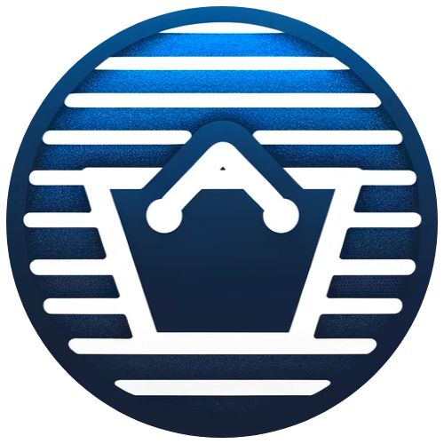

<h1 align="center">virtu-mall</h1>
<p align="center"></p>
<p align="center">VirtuMall는 파이썬으로 작성한, 쇼핑몰 프로젝트 입니다.</p>
<p align="center">효율적이고 안정적인 API를 제공하여 사용자가 손쉽게 다양한 쇼핑  관련 작업을 수행할 수 있도록 하는 목적을 가지고 있습니다.</p>

[](https://github.com/marketplace/actions/super-linter)

## Getting started

### Overview

Name    | Version
--------|---------
Python  | 3.11
Django  | 4.2.7

### Installation

0. 애플리케이션 구동에 필요한 환경을 설정합니다.
- 필요 소프트웨어
    - Python version >= 3.11 (venv)
- .env.example 을 참조하여 .env 를 backend 프로젝트 루트에 생성합니다.

1. 프로젝트 종속성을 설치합니다.
```shell
# Project venv 가 활성화되어있어야 합니다.
pip install -r requirements/requirements.txt
python manage.py migrate
```

2. 어드민에서 필요한 추가 설정을 위해 관리자 계정 생성 후 서버를 실행합니다.
```shell
python manage.py createsuperuser
python manage.py runserver
```
서버가 성공적으로 시작되면, 브라우저에서 `http://localhost:8000`을 통해 접근할 수 있습니다.


## Developer guide

### Docker build

0. 애플리케이션 구동에 필요한 환경을 설정합니다.
- 필요 소프트웨어
    - Docker >= 24.0.6
- .env.example 을 참조하여 .env 를 backend 프로젝트 루트에 생성합니다.

1. build docker image
```shell
docker build -f ./docker/Dockerfile -t aohus/virtu-mall .
```

2. run docker container
```shell
docker run --rm --name virtumall -p 8000:8000 -e PORT=8000 aohus/virtu-mall:latest
```

컨테이너가 실행되면, 브라우저에서 `http://localhost:8000`을 통해 접근할 수 있습니다.

### Testing

- TBD.

### Linting
Name    | Version | Description
--------|---------|----------------
Black   | 23.11.0 | Formats Python code adhering to our style guidelines.
Isort   | 5.12.0  | Sorts imports alphabetically and automatically separates them into sections.
Flake8  | 6.1.0   | Checks for PEP 8 compliance and other coding standards.
mypy    | 1.7.1   | Static type checker for Python.
